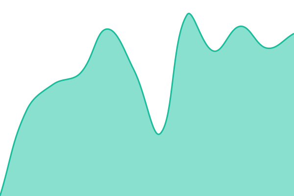
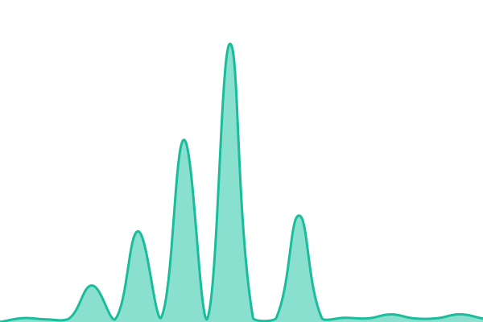
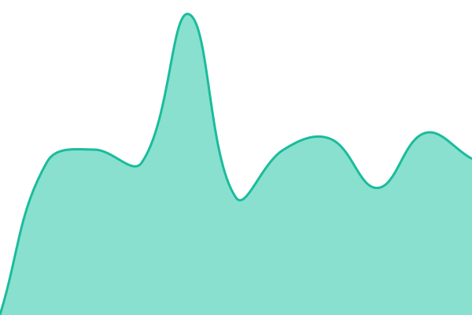
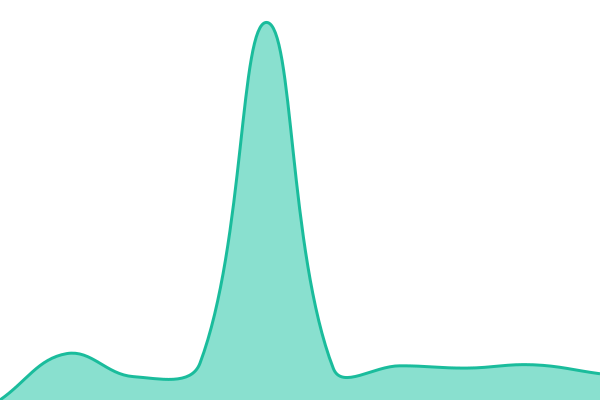
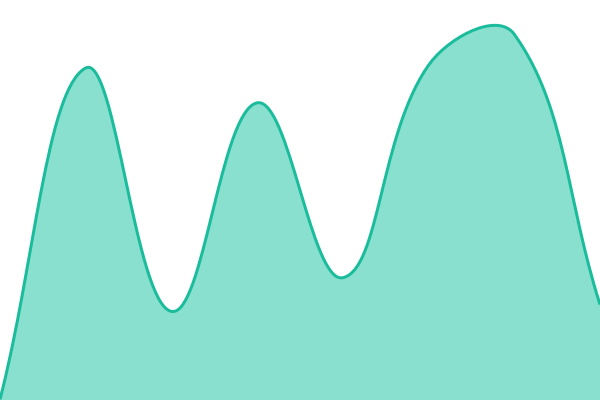
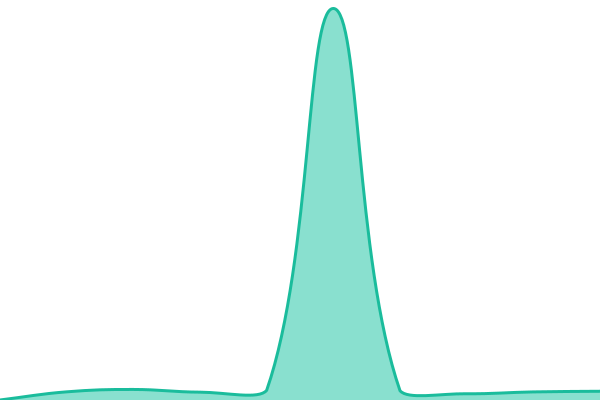

# [📈 Live Status](https://manticoresoftware.github.io/upptime): <!--live status--> **🟩 All systems operational**

This repository contains the open-source uptime monitor and status page for [Manticore Search](https://manticoresearch.com/), powered by [Upptime](https://github.com/upptime/upptime).

With [Upptime](https://upptime.js.org), you can get your own unlimited and free uptime monitor and status page, powered entirely by a GitHub repository. We use [Issues](https://github.com/manticoresoftware/upptime/issues) as incident reports, [Actions](https://github.com/manticoresoftware/upptime/actions) as uptime monitors, and [Pages](https://manticoresoftware.github.io/upptime) for the status page.

<!--start: status pages-->
<!-- This summary is generated by Upptime (https://github.com/upptime/upptime) -->
<!-- Do not edit this manually, your changes will be overwritten -->
<!-- prettier-ignore -->
| URL | Status | History | Response Time | Uptime |
| --- | ------ | ------- | ------------- | ------ |
|  [Slack Community](https://slack.manticoresearch.com) | 🟩 Up | [slack-community.yml](https://github.com/manticoresoftware/upptime/commits/HEAD/history/slack-community.yml) | 

 111ms
     
 | 

<a href="https://manticoresoftware.github.io/upptime/history/slack-community">100.00%</a>
    

|  [Manual](https://manual.manticoresearch.com/) | 🟩 Up | [manual.yml](https://github.com/manticoresoftware/upptime/commits/HEAD/history/manual.yml) | 

 2207ms
     
 | 

<a href="https://manticoresoftware.github.io/upptime/history/manual">99.43%</a>
    

|  [Manual (dev)](https://manual.manticoresearch.com/dev/) | 🟩 Up | [manual-dev.yml](https://github.com/manticoresoftware/upptime/commits/HEAD/history/manual-dev.yml) | 

 1150ms
     
 | 

<a href="https://manticoresoftware.github.io/upptime/history/manual-dev">99.43%</a>
    

|  [Playground](https://play.manticoresearch.com/) | 🟩 Up | [playground.yml](https://github.com/manticoresoftware/upptime/commits/HEAD/history/playground.yml) | 

 827ms
     
 | 

<a href="https://manticoresoftware.github.io/upptime/history/playground">100.00%</a>
    

|  [Did You Mean Playground](https://play.manticoresearch.com/didyoumean/) | 🟩 Up | [did-you-mean-playground.yml](https://github.com/manticoresoftware/upptime/commits/HEAD/history/did-you-mean-playground.yml) | 

 1059ms
     
 | 

<a href="https://manticoresoftware.github.io/upptime/history/did-you-mean-playground">88.46%</a>
    

|  [MySQL Playground](https://play.manticoresearch.com/mysql/) | 🟩 Up | [my-sql-playground.yml](https://github.com/manticoresoftware/upptime/commits/HEAD/history/my-sql-playground.yml) | 

 1058ms
     
 | 

<a href="https://manticoresoftware.github.io/upptime/history/my-sql-playground">88.46%</a>
    

|  [Package Repository](https://repo.manticoresearch.com) | 🟩 Up | [package-repository.yml](https://github.com/manticoresoftware/upptime/commits/HEAD/history/package-repository.yml) | 

 570ms
     
 | 

<a href="https://manticoresoftware.github.io/upptime/history/package-repository">100.00%</a>
    

|  [Community Forum](https://forum.manticoresearch.com) | 🟩 Up | [community-forum.yml](https://github.com/manticoresoftware/upptime/commits/HEAD/history/community-forum.yml) | 

 979ms
     
 | 

<a href="https://manticoresoftware.github.io/upptime/history/community-forum">99.43%</a>
    

|  [Documentation](https://docs.manticoresearch.com/latest/html/) | 🟩 Up | [documentation.yml](https://github.com/manticoresoftware/upptime/commits/HEAD/history/documentation.yml) | 

 917ms
     
 | 

<a href="https://manticoresoftware.github.io/upptime/history/documentation">100.00%</a>
    

|  [Chat](https://chat.manticoresearch.com) | 🟩 Up | [chat.yml](https://github.com/manticoresoftware/upptime/commits/HEAD/history/chat.yml) | 

 6282ms
     
 | 

<a href="https://manticoresoftware.github.io/upptime/history/chat">100.00%</a>
    

|  [Facet Demo](https://facet.manticoresearch.com) | 🟩 Up | [facet-demo.yml](https://github.com/manticoresoftware/upptime/commits/HEAD/history/facet-demo.yml) | 

 9474ms
     
 | 

<a href="https://manticoresoftware.github.io/upptime/history/facet-demo">100.00%</a>
    

|  [Image Search Demo](https://image.manticoresearch.com) | 🟩 Up | [image-search-demo.yml](https://github.com/manticoresoftware/upptime/commits/HEAD/history/image-search-demo.yml) | 

 570ms
     
 | 

<a href="https://manticoresoftware.github.io/upptime/history/image-search-demo">73.02%</a>
    

|  [GitHub](https://github.manticoresearch.com) | 🟩 Up | [git-hub.yml](https://github.com/manticoresoftware/upptime/commits/HEAD/history/git-hub.yml) | 

 487ms
     
 | 

<a href="https://manticoresoftware.github.io/upptime/history/git-hub">100.00%</a>
    

|  [Catalog Demo](https://catalog.manticoresearch.com) | 🟩 Up | [catalog-demo.yml](https://github.com/manticoresoftware/upptime/commits/HEAD/history/catalog-demo.yml) | 

 879ms
     
 | 

<a href="https://manticoresoftware.github.io/upptime/history/catalog-demo">99.04%</a>
    

|  [Facet Demo Search](https://facet.manticoresearch.com/healthz) | 🟩 Up | [facet-demo-search.yml](https://github.com/manticoresoftware/upptime/commits/HEAD/history/facet-demo-search.yml) | 

 3464ms
     
 | 

<a href="https://manticoresoftware.github.io/upptime/history/facet-demo-search">100.00%</a>
    

|  [Catalog Search](https://catalog.manticoresearch.com/?q=Tigris&limit=20&page=1) | 🟩 Up | [catalog-search.yml](https://github.com/manticoresoftware/upptime/commits/HEAD/history/catalog-search.yml) | 

 971ms
     
 | 

<a href="https://manticoresoftware.github.io/upptime/history/catalog-search">99.14%</a>
    

|  [Catalog Autocomplete](https://catalog.manticoresearch.com/api/autocomplete?term=Tigris&limit=5) | 🟩 Up | [catalog-autocomplete.yml](https://github.com/manticoresoftware/upptime/commits/HEAD/history/catalog-autocomplete.yml) | 

 493ms
     
 | 

<a href="https://manticoresoftware.github.io/upptime/history/catalog-autocomplete">99.23%</a>
    

|  [Cloudflare Monitor](https://manticore-upptime-monitor.sergey-979.workers.dev/ready) | 🟩 Up | [cloudflare-monitor.yml](https://github.com/manticoresoftware/upptime/commits/HEAD/history/cloudflare-monitor.yml) | 

 259ms
     
 | 

<a href="https://manticoresoftware.github.io/upptime/history/cloudflare-monitor">95.61%</a>
    

<!--end: status pages-->

[**Visit our status website →**](https://manticoresoftware.github.io/upptime)

## 📄 License

- Powered by: [Upptime](https://github.com/upptime/upptime)
- Code: [MIT](./LICENSE) © [Anand Chowdhary](https://anandchowdhary.com)
- Data in the `./history` directory: [Open Database License](https://opendatacommons.org/licenses/odbl/1-0/)
